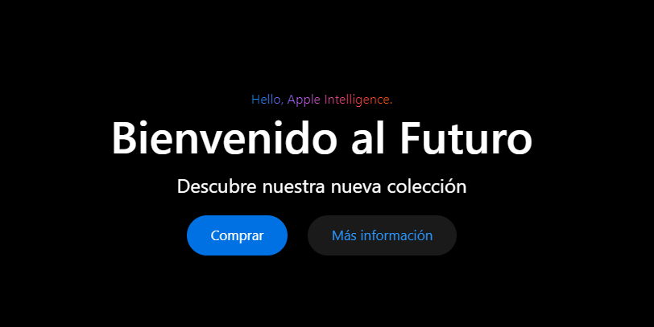
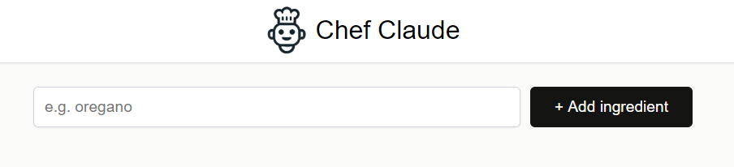
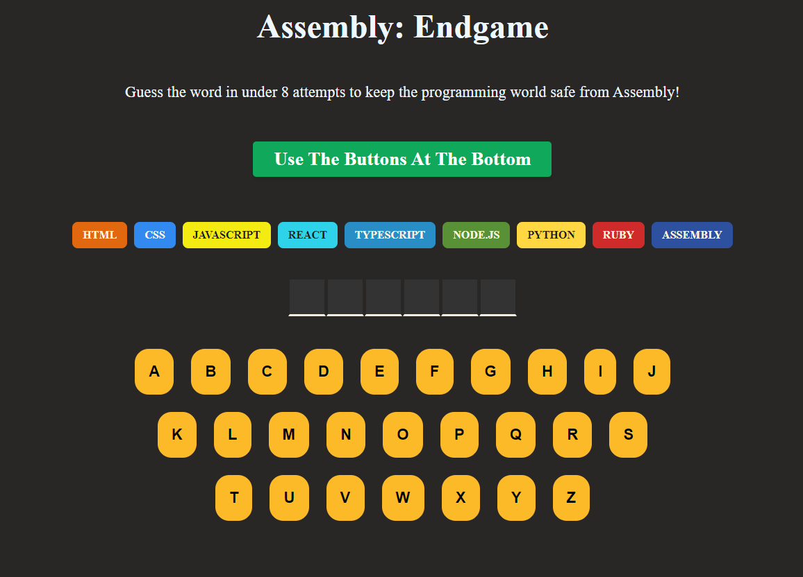
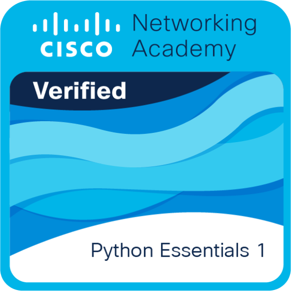
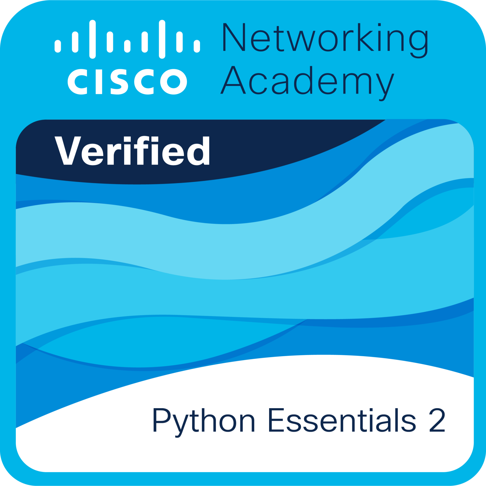
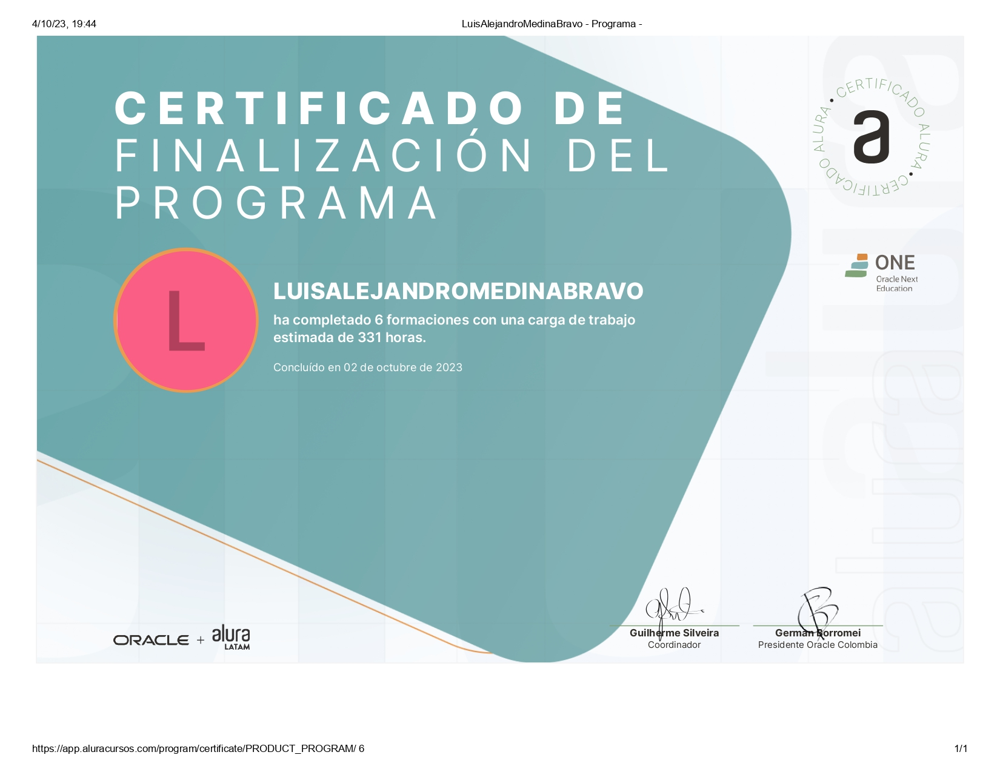
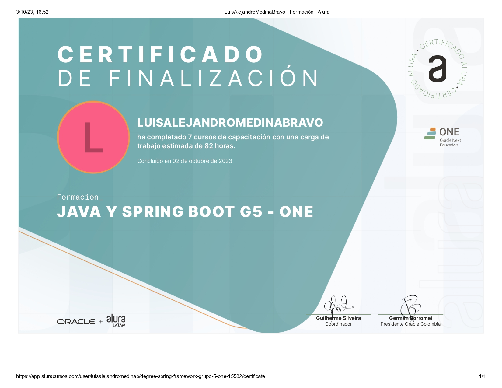
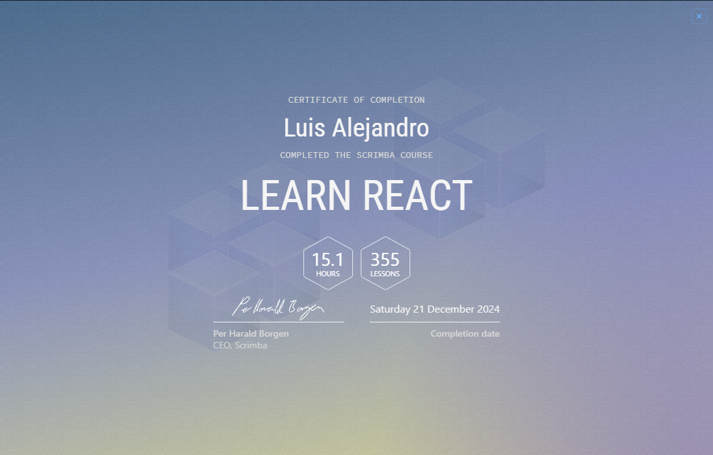

<h1 align="center"><b>Hi, I´m Luis Alejandro Medina Bravo </b></h1>

  

 

## 🚀 About me

I am a passionate software developer with experience in the BackEnd area mainly. I love creating innovative solutions and learning new technologies.

- 🔭 I'm currently working on my personal portafolio
- 🌱 I'm learning Go and improving my React skills
- 👯 I'm looking to collaborate on internship projects
- 🎯 My goal is to become a Full Stack Developer.
- ❤️ I love sharing knowledge and collaborating with other developers.

 

#⚒️ Languages

  

#⚡ FrameWorks

  

#⚡ Tools

  

# 🖥️ Projects

Here are some of the projects I've been working on:

### 💼 [Portfolio](https://glittery-chebakia-f08b4a.netlify.app/)
Link: https://glittery-chebakia-f08b4a.netlify.app/

Repository: https://github.com/KiaX45/Portafolio

🛠️ About This Project
This is my personal portfolio, where you can:

Learn more about me and my skills.
Explore the projects I’ve been working on, including detailed descriptions and live demos.

### 🛒 [E-commerce Store](https://appleudenar-1.onrender.com/)
Link: https://appleudenar-1.onrender.com/ (For a better experience it is recommended to use Google Chrome)

Repository: https://github.com/KiaX45/appleUdenar

An online store built with Django, featuring:
- Dynamic price updates based on currency selection.
- Automatic email notifications for purchases.
- A sleek dark mode toggle.
- Email authentication with google
- Paypal payments (only for sandbox accounts)

### 🥘 [Recipe Ingredients App](https://cheffai.netlify.app/)

Link: https://cheffai.netlify.app/
Repository: https://github.com/KiaX45/Chef

A React application that allows users to:
- Add your own ingredients to a list.
- Request a recipe with the ingredients listed.

### 🎮 [Assembly end Game](https://legendary-lollipop-5f1446.netlify.app/)

Link : https://legendary-lollipop-5f1446.netlify.app/
Repository : https://github.com/KiaX45/Assembly

A fun word guessing game that allows users to:
- Click on the buttons to try to guess the secret word.
- Get different words from an api with thousands of options
- A simple interface full of colors.
- Get immediate feedback based on the options chosen

 

# 📊 GitHub Stats:
 
 

## 🏆 GitHub Trophies

## 🎓 Certifications

  
  

 

