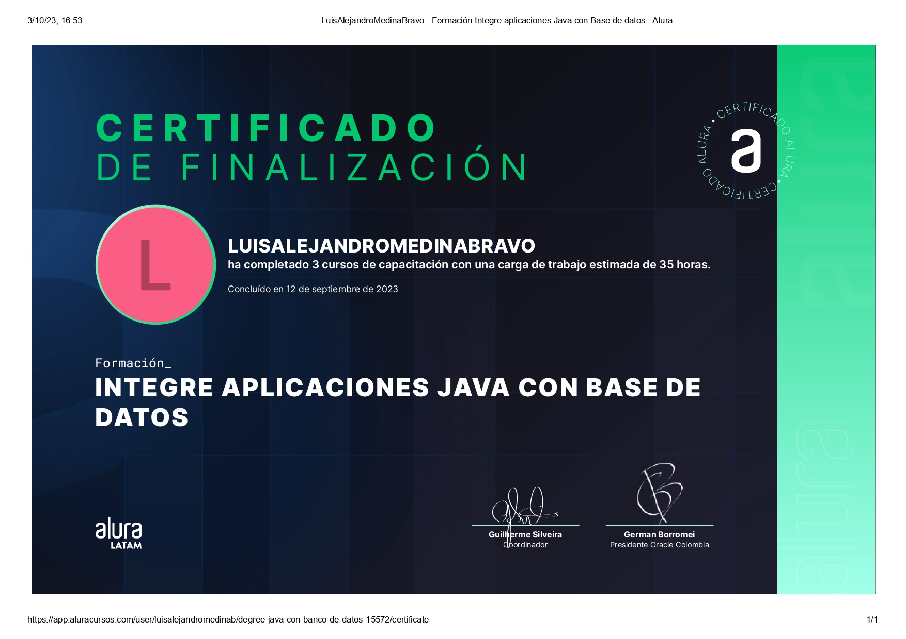

<h1 align="center"><b>Hi, I´m Luis Alejandro Medina Bravo </b></h1>

  

 

## 🚀 About me

I am a passionate software developer with experience in the BackEnd area mainly. I love creating innovative solutions and learning new technologies.

- 🔭 I'm currently working on an app that lists ingredients for a new recipe
- 🌱 I'm learning Go and improving my React skills
- 👯 I'm looking to collaborate on internship projects

 

#⚒️ Languages

  

#⚡ FrameWorks

  

#⚡ Tools

  

 

# 📊 GitHub Stats:
 
 

## 🏆 GitHub Trophies

## 🎓 Certifications

  
  

 

